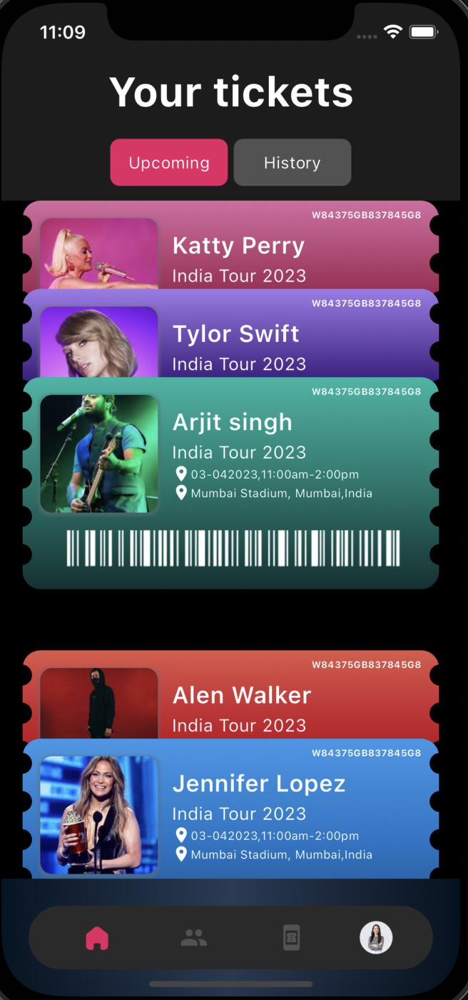

# Flutter Ticket UI

Welcome to the Flutter Ticket UI project! This repository contains a Flutter application for a Ticket UI that can be easily integrated into your Flutter projects.

## Features

- Display and manage tickets in a visually appealing manner.
- Responsive design for seamless viewing on different devices.
- Easily customizable Flutter widgets for integration with your project.

## Screenshots



## Getting Started

To integrate the Ticket UI into your Flutter project, follow these steps:

1. Add the package to your `pubspec.yaml` file:

   ```yaml
   dependencies:
     ticket_ui: ^1.0.0
